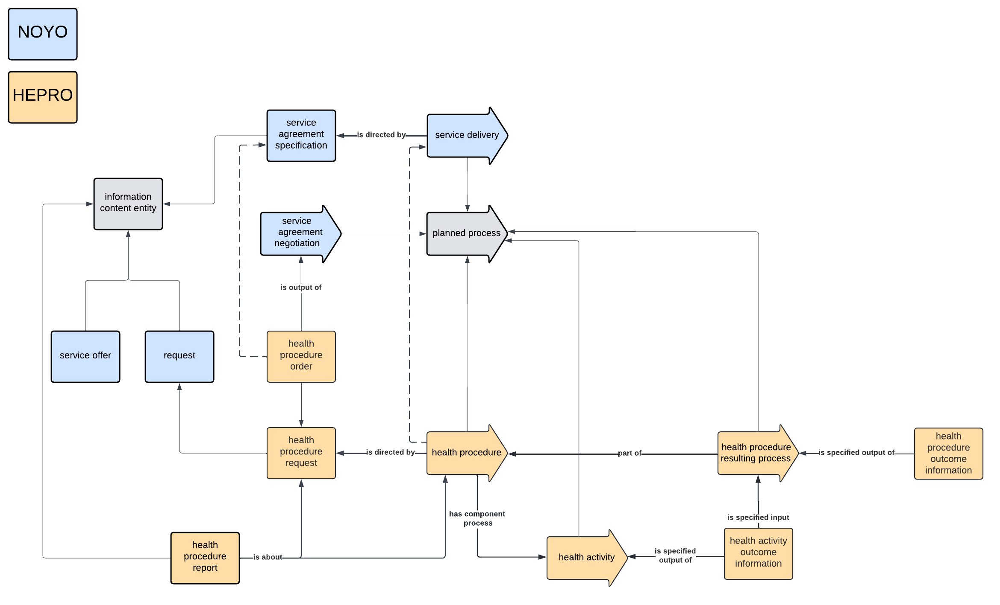

# HEPRO Ontology Documentation

[//]: # "This file is meant to be edited by the ontology maintainer."

Welcome to the HEPRO documentation!

You can find descriptions of the standard ontology engineering workflows [here](odk-workflows/index.md).

## NOYO schema

## Classes

|IRI          |value                               |def                                                                                                                                                                                                                                                                                                                       |
|-------------|------------------------------------|--------------------------------------------------------------------------------------------------------------------------------------------------------------------------------------------------------------------------------------------------------------------------------------------------------------------------|
|HEPRO_0000008|health activity outcome information |An information content entity that is a specified output of a health activity.                                                                                                                                                                                                                                            |
|HEPRO_0000007|health procedure outcome information|An information content entity that is the output of a health procedure resulting process and that describes some outcomes of a health procedure.                                                                                                                                                                          |
|HEPRO_0000006|health procedure resulting process  |A planned process that is a part of a health procedure, that has as specified input at least one health activity outcome information and aim at generating a health procedure outcome information.                                                                                                                        |
|HEPRO_0000005|health activity                     |A planned process that aims to produce a truthful statement about the health status of an organism or modify it.                                                                                                                                                                                                          |
|HEPRO_0000004|health procedure                    |A planned process guided by the objective of contributing to a desired effect on the health status of an organism or several organisms achieved through the treatment, diagnosis, or prevention of disease or injury. It has some components that are planned processes, including at least one that is a health activity.|
|HEPRO_0000003|health procedure report             |An information content entity containing information about some health procedure requests and possibly the associated health procedures.                                                                                                                                                                                  |
|HEPRO_0000002|health procedure order              |A health procedure request  that is the output of a service agreement made between a request party and a service offer party and that specifies some health procedures to be realized.                                                                                                                                    |
|HEPRO_0000001|health procedure request            |A request specifying the execution of some health procedures.                                                                                                                                                                                                                                                             |
